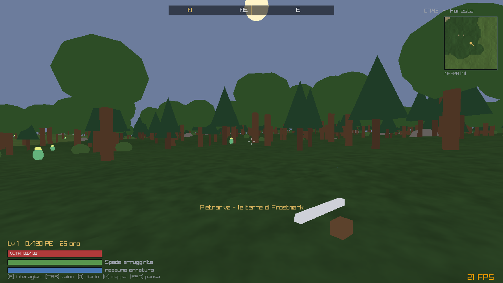
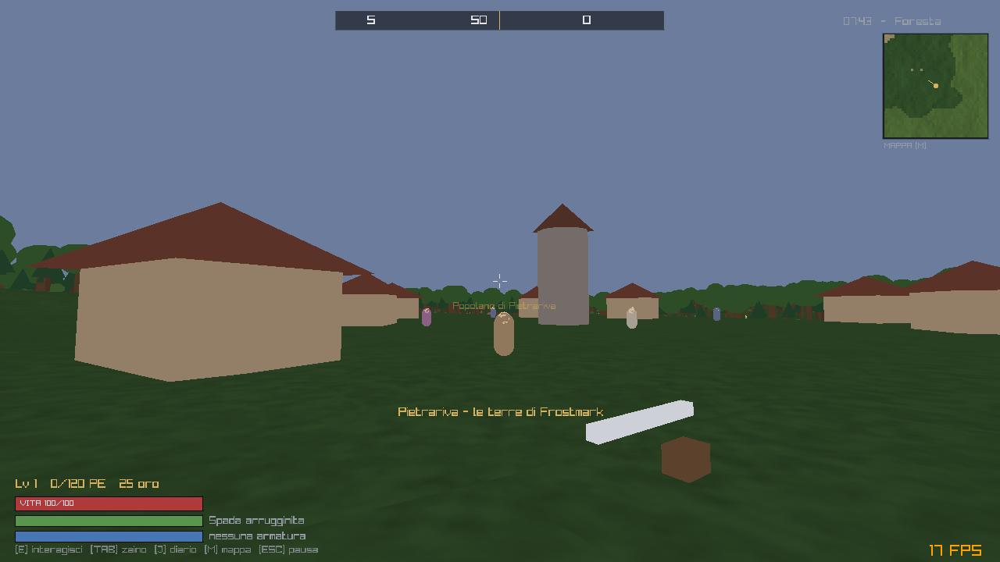
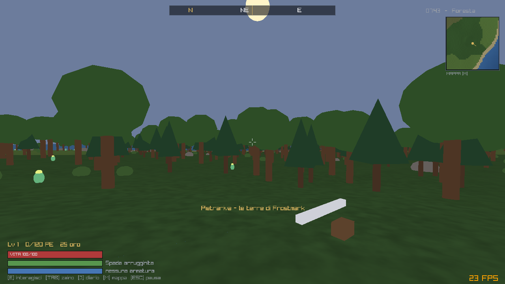

# Frostmark

Un piccolo RPG open world ispirato a *The Elder Scrolls V: Skyrim*, in prima o
terza persona, scritto in **C99 standard** con la sola libreria **raylib**.

Il progetto ha due obiettivi dichiarati:

1. **Didattico** — ogni sistema (mondo, IA, quest, inventario, salvataggio) sta in
   un modulo breve e leggibile, senza astrazioni inutili. ~2.700 righe in totale.
2. **Operativo** — non è uno scheletro: si compila, si gioca, si finisce.

Il mondo è **generato proceduralmente** (4096 × 4096 metri), non ci sono asset
binari obbligatori: texture, terreno, edifici e personaggi sono costruiti a
runtime. Gli asset esterni sono **opzionali** e, quando servono, si usano solo
fonti pubbliche CC0 (vedi `docs/03-asset-pubblici.md`).





---

## Compilazione

Serve un compilatore C99 e raylib (≥ 4.5, testato con 5.5). Il Makefile cerca
raylib in quest'ordine: `RAYLIB_PATH=dir` → submodule `vendor/raylib` →
`pkg-config` → `-lraylib`. Il target WebAssembly è stato abbandonato: vedi
`docs/05-piano-dati-esterni-e-motore.md`.

### Con il submodule (consigliato: versione fissata, niente pacchetti di sistema)

raylib 5.5 è agganciata come submodule in `vendor/raylib`.

```bash
git clone --recurse-submodules git@github.com:gomutako/Frostmark.git
cd Frostmark
make raylib          # compila libraylib.a dai sorgenti, una volta sola (~1 min)
make && ./frostmark
```

Se il repository è già clonato senza submodule:

```bash
git submodule update --init vendor/raylib
```

Su Linux la compilazione di raylib richiede gli header di sviluppo di X11 e
OpenGL:

```bash
sudo apt install build-essential libx11-dev libxrandr-dev libxinerama-dev \
                 libxcursor-dev libxi-dev libgl1-mesa-dev
```

`make raylib-clean` ributta via la libreria compilata; `make clean` non la
tocca.

### Con raylib installata nel sistema

Se il submodule non è inizializzato, il Makefile ricade su `pkg-config`.

```bash
sudo apt install build-essential libraylib-dev   # Debian/Ubuntu, se esiste
brew install raylib                              # macOS
pacman -S mingw-w64-x86_64-gcc mingw-w64-x86_64-raylib make   # MSYS2/MinGW-w64
make
```

### Con una release precompilata

```bash
curl -LO https://github.com/raysan5/raylib/releases/download/5.5/raylib-5.5_linux_amd64.tar.gz
mkdir -p vendor && tar xzf raylib-5.5_linux_amd64.tar.gz -C vendor/
make RAYLIB_PATH=vendor/raylib-5.5_linux_amd64
```

### Asset opzionali

```bash
./tools/fetch_assets.sh              # prepara assets/ e stampa le fonti CC0
./tools/fetch_assets.sh models       # scarica i modelli low-poly CC0 di Kenney
./tools/fetch_assets.sh player       # scarica il personaggio animato CC0 (KayKit)
./tools/fetch_assets.sh npc          # scarica i personaggi animati degli NPC
./tools/fetch_assets.sh heightmap    # genera anche una heightmap di prova
```

Gli asset riconosciuti in automatico, senza toccare il codice — se mancano, il
gioco ricade sulle primitive:

| File | Effetto |
|---|---|
| `assets/textures/grass.png` | texture del terreno al posto della grana cotta |
| `assets/models/tree.glb`, `pine.glb`, `rock.glb`, `bush.glb`, `herb.glb` | modelli al posto delle primitive (alberi, sassi, cespugli, erbe) |
| `assets/models/player.glb` | personaggio animato in terza persona (camminata, corsa, attacco, parata, salto, morte) |
| `assets/models/npc_villager.glb`, `npc_guard.glb`, `npc_bandit.glb`, `npc_revenant.glb`, `npc_boss.glb` | NPC animati; l'animazione segue lo stato dell'IA |

Una heightmap esterna (QGIS/GDAL, Blender, GIMP) non si innesta più a caldo: si
passa al baker, che la cuoce nel mondo. Vedi *Il mondo cotto* qui sotto e
`docs/02-generazione-mondo.md`.

Font e audio richiedono invece qualche riga di codice: vedi
`docs/03-asset-pubblici.md`.



### Dati di gioco

I dati non stanno nel codice. In `assets/data/`, versionati nel repository:

| File | Contenuto |
|---|---|
| `balance.txt` | velocità, gravità, parata, curva di esperienza, durata del giorno |
| `items.txt` | oggetti: nome, tipo, prezzo, potenza |
| `entities.txt` | tipi di personaggio: statistiche, colore, modello, comportamento |
| `quests.txt` | incarichi: obiettivo, committente, come avanzano, ricompense |
| `shop.txt` | assortimento del mercante |
| `rumors.txt` | dicerie |

**Non hanno valori di ripiego**: se un file manca o contiene un errore il gioco
non parte e dice cosa non torna.

```bash
./frostmark --valida     # controlla i dati ed esce; 0 se sono a posto
```

La diagnostica indica file e riga:

```
ERROR: assets/data/items.txt:42: tipo: "corazza" non ammesso;
       valori possibili: nessuno, arma, armatura, pozione, cibo, varie
```

Aggiungere un nemico, ribilanciare la gravità o scrivere una quest non richiede
di ricompilare. Restano nel codice i soli dialoghi e i testi dell'interfaccia:
vedi `docs/05-piano-dati-esterni-e-motore.md`.

### Il mondo cotto

Il mondo **non si genera all'avvio**. Si cuoce una volta da un seme e da quel
momento `assets/world/` è la sorgente di verità: versionata nel repository,
14,5 MB, e modificabile.

```bash
make mondo             # cuoce assets/world/ se non c'è (2 s)
make mondo-forza       # ricuoce, cancellando le modifiche fatte a mano
make verifica-mondo    # confronta il mondo cotto con quello generato dal seme
./baker --seme 12345 --out /tmp/altro-mondo
./baker --heightmap assets/heightmap.png --forza   # quote da un PNG
```

| File | Contenuto |
|---|---|
| `manifest.txt` | seme d'origine, dimensioni, risoluzione, versione |
| `height.bin` | 2049 × 2049 quote a 2 m di passo, uint16 a 1 cm — 8,4 MB |
| `biome.bin` | i biomi sulla stessa griglia, uint8 — 4,2 MB |
| `props.bin` | 168.733 alberi, sassi, case e cripte indicizzati per chunk, 10 byte ciascuno |
| `spawns.txt` | villaggi, abitanti, cripta e punto di partenza — **fatto per essere modificato a mano** |
| `grain.png` | grana del terreno, cotta perché nasceva dal rumore |

Spostare un villaggio, aggiungere una guardia o cambiare il punto di partenza è
una riga in `spawns.txt` e si vede al riavvio. Il seme non è più un argomento del
gioco: si passa al baker.

```bash
./frostmark            # gioca il mondo in assets/world/
./frostmark --valida   # controlla dati e mondo, elenca i problemi, esce
```

---

## Comandi

| Tasto | Azione |
|---|---|
| `W A S D` | Movimento |
| `Mouse` | Guardarsi attorno |
| `F` | Alterna prima e terza persona |
| `Rotellina` | Allontana o avvicina la camera (fino a rientrare in soggettiva) |
| `Shift` | Corsa (consuma vigore) |
| `Spazio` | Salto |
| `Tasto sinistro` | Attacco in mischia |
| `Tasto destro` | Dardo di fuoco (consuma magia) |
| `Ctrl sinistro` | Para (rallenta, consuma vigore, dimezza i danni) |
| `E` | Parla / raccogli |
| `R` | Bevi rapidamente una pozione di cura |
| `TAB` | Zaino (inventario) |
| `J` | Diario delle missioni |
| `M` | Mappa del mondo |
| `ESC` | Pausa (`F5` salva, `F9` carica) |

Nei menu: `↑ ↓` per scorrere, `Invio` per confermare, `ESC` per uscire.

---

## Cosa c'è nel gioco

- **Mondo aperto** 4096 × 4096 m con biomi (oceano, spiaggia, pianura, foresta,
  colline, montagna, nevi), streaming dei chunk e distanza visiva di ~320 m.
- **5 villaggi** con case, torre, popolani, guardie,
  un mercante e un anziano; il terreno viene spianato automaticamente sotto
  l'abitato.
- **Ciclo giorno/notte** (12 minuti reali = 24 ore di gioco) che tinta cielo,
  terreno e personaggi.
- **Due visuali**: prima persona con arma a schermo, terza persona con la
  camera dietro le spalle; si alternano con `F` o con la rotellina.
- **Personaggio animato** opzionale in terza persona: se `assets/models/player.glb`
  esiste, le animazioni di riposo, camminata, corsa, attacco, parata,
  incantesimo, salto, colpo ricevuto e morte vengono scelte dallo stato di gioco.
  Arma, scudo ed elmo seguono le ossa (vedi `assets/models/player.attach`).
- **NPC animati**: gli stessi ruoli valgono per popolani, guardie, banditi,
  redivivi e boss, guidati dalla macchina a stati dell'IA. Lo stesso modello
  serve piu' personaggi con pose diverse, rideformandolo dentro il ciclo di
  disegno (~0,06 ms per NPC visibile). I lupi restano procedurali.
- **Combattimento** in mischia a cono + magia a proiettile, con vigore e magia.
- **Nemici** con IA a stati (lupi, banditi, redivivi) che compaiono in base al
  bioma, e un **boss** nella cripta.
- **3 missioni** concatenate: caccia ai lupi → erbe curative → il Sepolto.
- **Inventario, equipaggiamento, negozio, dialoghi, livelli ed esperienza.**
- **Salvataggio** dello stato del giocatore; il seme salvato identifica il mondo,
  e una partita fatta in un altro mondo viene rifiutata invece di caricata male.
- **Mappa e minimappa** disegnate campionando lo stesso mondo cotto.

---

## Struttura del codice

```
src/
  config.h    costanti di compilazione (scala del mondo, limiti degli array)
  dataid.h    identificatori stabili per i dati (hash FNV-1a)
  balance.c/h    numeri di bilanciamento caricati da file
  dataparse.c/h  lettore dei file di dati, con diagnostica per riga
  gamedata.c/h   caricamento di tutti i dati all'avvio
  fmath.c/h   hash deterministico e interpolazioni condivise
  worldtypes.h  tipi del mondo condivisi con gli strumenti
  worldfmt.h  formato del mondo cotto e sua quantizzazione
  worldio.c/h caricamento di assets/world/: quote, biomi, prop, spawn
  world.c/h   mesh dei chunk, streaming, prop, disegno, collisioni
  player.c/h  movimento, statistiche, camera in prima/terza persona
  entity.c/h  NPC, nemici, IA a stati finiti, proiettili
  items.c/h   database oggetti + inventario
  quest.c/h   missioni e dialoghi generati dallo stato di gioco
  charmodel.c/h  modello di personaggio animato, condiviso da giocatore e NPC
  ui.c/h      HUD, menu, inventario, diario, mappa, negozio
  save.c/h    salvataggio binario
  game.c/h    stato globale, ciclo di gioco, combattimento, disegno
  main.c      finestra e loop principale
assets/data/  dati di gioco: oggetti, negozio, dicerie (obbligatori)
assets/world/ il mondo cotto: quote, biomi, prop, spawn (obbligatorio)
docs/         approfondimenti didattici
tools/
  baker.c     cuoce il mondo dal seme in assets/world/
  worldgen.c/h  la generazione: rumore, biomi, villaggi, prop
  noise.c/h   value noise, fBm, ridged noise deterministici
  *.sh, *.py  script per generare o scaricare asset opzionali
vendor/
  raylib/     submodule: sorgenti di raylib 5.5 (l'unica dipendenza)
```

**Dipendenze**: solo raylib e la libreria standard C (`math.h`, `stdio.h`,
`string.h`, `stdlib.h`, `stdarg.h`). Nessun'altra libreria, nessun C++.

Il file da leggere per primo è `src/worldio.c`, insieme a `src/worldfmt.h`: il
mondo è un **dato**, cotto una volta da un seme e da lì in poi modificabile.
Mesh, collisioni, minimappa e villaggi interrogano tutti `WorldHeight()`, che
legge la griglia caricata. La generazione — il rumore, i biomi, i villaggi, lo
spargimento dei prop — vive in `tools/worldgen.c` e **non è compilata nel gioco**:
`nm frostmark | grep Noise` non trova niente di nostro.

Nel repository c'è ancora la vecchia idea, per chi vuole vederla: fino al commit
"Fase 2" l'altezza era una funzione pura `WorldHeight(seed, x, z)` e il mondo si
rigenerava a ogni avvio. `docs/05-piano-dati-esterni-e-motore.md` spiega perché è
stata abbandonata e cosa si è guadagnato.

---

## Documentazione

- `docs/01-architettura.md` — come sono divisi i moduli e perché
- `docs/02-generazione-mondo.md` — il rumore, i biomi, e come usare **heightmap
  esterne** prodotte con QGIS/GDAL, Blender o GIMP (ora si passano al baker)
- `docs/03-asset-pubblici.md` — dove prendere asset CC0 e come innestarli
- `docs/04-esercizi.md` — 12 esercizi progressivi, dal più semplice al più tosto

---

## Licenza

Codice: **MIT** (vedi `LICENSE`). raylib è distribuita con licenza zlib/libpng.
Gli asset eventualmente scaricati mantengono la propria licenza: usare solo
sorgenti CC0 / pubblico dominio come indicato in `docs/03-asset-pubblici.md`.
