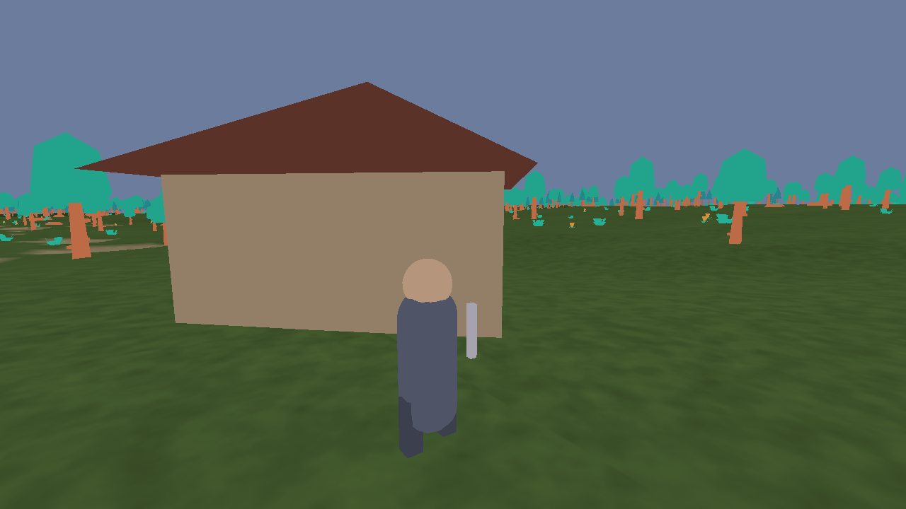

# 01 — Architettura

## Il principio guida

Un gioco di questo tipo può facilmente diventare un groviglio. Frostmark segue
tre regole, e tutto il resto discende da lì.

**Regola 1 — Il mondo si interroga da un solo posto.**
`WorldHeight(world, x, z)` restituisce l'altezza del terreno in qualunque punto.
Chi la chiama non sa da dove viene, e questo è il punto: collisioni, mesh,
minimappa e villaggi passano tutti da lì.

- la collisione con il terreno è una riga: `if (pos.y <= WorldHeight(...))`;
- la mesh di un chunk si costruisce campionando la stessa funzione;
- la mappa del mondo si disegna campionando la stessa funzione su una griglia;
- non esistono desincronizzazioni tra "quello che vedo" e "dove sbatto".

Fino alla fase 3 del piano (`docs/05`) quella funzione *calcolava* l'altezza dal
seme: il mondo era una funzione, non un dato. Ora legge una griglia cotta una
volta da `tools/baker` e caricata da `assets/world/` — 2048 × 2048 quote a 2 m di
passo, 8,4 MB. La firma è la stessa, i chiamanti non sono cambiati, ma il mondo è
diventato **autoriale**: si può spostare un albero o spianare una radura, e la
modifica resta. Era il presupposto della fisica.

Il prezzo pagato, dichiarato: il salvataggio non è più un `unsigned int` che
rigenera tutto — il seme che contiene serve solo a riconoscere il mondo e a
rifiutare una partita fatta in un altro — e senza `assets/world/` il gioco non
parte.

**Regola 2 — Lo stato del gioco sta in una sola struttura.**
`Game` (in `game.h`) contiene mondo, giocatore, entità, proiettili, quest e stato
dell'interfaccia. Viene allocata `static` in `main.c` e passata per puntatore.
Niente variabili globali sparse, niente singleton, niente allocazioni dinamiche
nel ciclo di gioco.

**Regola 3 — L'interfaccia è una macchina a stati.**
`GameState` (`GS_MENU`, `GS_PLAY`, `GS_INVENTORY`, …) decide sia quale funzione
di aggiornamento gira, sia quale schermata viene disegnata. Aggiungere una
schermata significa: un valore nell'enum, un `case` in `GameUpdate`, un `case` in
`GameDraw`, una funzione in `ui.c`. Nient'altro.

## Il ciclo di gioco

```
main()
 └─ while (!WindowShouldClose())
     ├─ GameInput(g)                    una volta per fotogramma
     │   └─ switch (g->state)            tasti, mouse, menu, dialoghi
     ├─ GameSimulate(g, SIM_STEP)        a passo fisso, anche piu' volte
     │   └─ GS_PLAY → UpdatePlaying()
     │            ├─ PlayerUpdate()          movimento, gravità, stamina
     │            ├─ WorldUpdateStreaming()   carica/scarica chunk
     │            ├─ EntitiesPopulate()       spawn/despawn nemici
     │            ├─ EntitiesUpdate()         IA e attacchi
     │            ├─ ProjUpdate()             proiettili
     │            └─ input di combattimento/interazione
     ├─ GameUpdateCamera(g)              dopo i passi, una volta per fotogramma
     │                                    (dipende da yaw e pitch, che l'input
     │                                     aggiorna per fotogramma)
     └─ GameDraw(g)
         ├─ BeginMode3D → terreno, prop, entità, proiettili, acqua
         └─ 2D → marker, HUD, schermata attiva

`PlayerUpdate()` in discesa si **aggancia al terreno**: senza, a ogni passo il
suolo scende sotto i piedi, il giocatore resta in aria per un fotogramma e la
gravità lo riprende — un sobbalzo ritmico di pochi centimetri, e `onGround`
falso quasi sempre, quindi niente salto e niente parata. Ci si incolla solo per
il dislivello che un passo può giustificare (`STEP_DOWN_SLOPE` in `config.h`):
un salto nel vuoto resta una caduta, con il suo danno.

Il terreno non è più l'unica superficie calpestabile: negli edifici alti
`WorldSupportHeight()` restituisce il solaio del primo piano e la quota della
rampa delle scale, e `PlayerUpdate()` prende la più alta che stia sotto ai piedi
entro `STEP_UP_REACH` — un gradino. Più in alto di così non ci si arrampica,
quindi stando al piano terra il solaio di sopra non risucchia in alto, e
salendo la rampa ci si alza davvero. Misurato salendo: +1,37 m a metà rampa,
+2,60 in cima, che è l'altezza esatta di un piano.

La rampa però non è solo una quota su cui posare i piedi: è anche un volume.
Finché è stata solo una superficie la si attraversava, perché di fianco e da
sopra sta più in alto di un gradino e `WorldSupportHeight()` la scartava.
`ResolveHouse()` respinge quindi dalla cella della scala dove la rampa supera i
piedi di più di `STEP_UP_REACH`: il piede della rampa resta aperto — è da lì
che si sale — chi ci sta già sopra ha i piedi alla quota giusta e non viene
toccato, e dal piano di sopra la tromba resta libera per scendere. Disegno,
quota calpestabile e volume solido leggono la stessa `StairTop()`: se
divergessero si sbatterebbe contro un gradino che non si vede.

Il giocatore cammina sulla **superficie che vede**: `WorldIoHeight()` legge la
quota sui due triangoli del quadrato, con lo stesso taglio che usa
`BuildChunkMesh()`, non su una superficie bilineare. Le due differiscono di
pochi centimetri, ma la differenza cambia a ogni quadrato attraversato:
misurata correndo in diagonale a 9 m/s, 2,3 cm di ampiezza a quasi quattro
oscillazioni al secondo — un saltellio fine che si sentiva proprio correndo.
Lungo un asse della griglia le due superfici coincidono, ed è per questo che il
difetto spariva andando dritti a nord o a est.

### Luce e ombre

Prima non c'era luce: il terreno portava un'illuminazione **cotta** nei colori
dei vertici, calcolata una volta da una direzione fissa, e tutto il resto veniva
solo moltiplicato per la tinta del ciclo giorno/notte. Nessuna faccia era più
chiara di un'altra e niente proiettava ombra.

Ora `src/light.c` tiene un sole direzionale e una mappa di profondità vista dal
sole. Lo shader (`assets/shaders/scene.vs|fs`) è uno solo e serve terreno, prop
e personaggi: nel passaggio d'ombra scrive soltanto la profondità, nel disegno
vero somma ambiente e sole e legge l'ombra dalla mappa.

Tre decisioni che si vedono:

- **Le mappe sono due**, entrambe 2048 texel: una stretta attorno al giocatore
  (48 m di lato, 2,3 cm per texel) e una larga per il resto (120 m, 5,9 cm). Con
  una sola bisognava scegliere fra ombre nitide e ombre lontane: a 3,9 cm per
  texel, a tre metri dalla camera un texel copriva quasi sette pixel di schermo
  e i blocchi si vedevano. Le due passate costano 3,3 ms.
- **Il quadrato della mappa è spostato verso il sole**, non centrato sul
  giocatore: le ombre cadono dalla parte opposta al sole, quindi chi può
  oscurarti sta dalla parte del sole. Centrandolo sul giocatore, una torre a
  venti metri restava fuori e la sua ombra spariva.
- **La proiezione dev'essere quadrata quanto la mappa.** Accendendo il
  framebuffer a mano, `BeginMode3D()` prendeva l'aspetto dello *schermo*: la
  proiezione copriva 124 m in orizzontale contro 70 in verticale, schiacciati
  negli stessi texel, e le ombre uscivano a scaletta. `BeginTextureMode()` dice
  a raylib quanto è grande il bersaglio, e l'aspetto torna 1:1.
- **Il sole pesa quasi il doppio dell'ambiente** (0,85 contro 0,45). Con i due
  alla pari l'ombra toglieva un quarto della luce e non si vedeva.
- **La luce cotta nel terreno sparisce** quando lo shader c'è, altrimenti le
  colline sarebbero scure due volte. Senza `assets/shaders/` il gioco torna
  esattamente a com'era: l'assenza di un file non è un errore.

### Normal map

La normale del vertice descrive la forma grossa di un oggetto. Il rilievo fine
— la corteccia, la fuga fra due pietre — sta in una **normal map**, ed è metà di
ciò che fa sembrare realistico un asset. Lo shader la legge da `texture2`, che è
dove raylib lega `MATERIAL_MAP_NORMAL`; le mappe d'ombra vivono negli slot 10 e
11, apposta per non stare fra i piedi alle texture del materiale.

La mappa è espressa **in spazio tangente**, cioè relativa alla superficie: per
usarla serve la terna tangente/bitangente/normale. Tre trappole, tutte trovate
scrivendola:

- **Raylib lega `texture2` solo se il materiale ha davvero una normal map.**
  Senza, l'uniform resta a zero — cioè allo stesso slot dell'albedo — e lo
  shader leggerebbe il *colore* come rilievo: ogni asset senza normal map, cioè
  tutti quelli di oggi, si illuminerebbe a caso. Perciò `LightApplyToMaterial()`
  installa su chi non ce l'ha una normale **piatta**, un pixel `(128,128,255)`
  che vale `(0,0,1)` e significa "non piegare niente". Una copia per materiale e
  non una condivisa: `UnloadMaterial()` libera le texture delle mappe, e una
  texture sola liberata due volte è un guaio che si paga lontano da dove è stato
  commesso. Un pixel per materiale non si misura.
- **Quando la mesh non porta tangenti raylib passa `{0,0,0,0}`.** Un
  Gram-Schmidt su un vettore nullo dà NaN, quindi il fragment controlla prima di
  costruire la terna e in quel caso resta alla normale del vertice.
- **`GenMeshTangents()` di raylib 5.5 ignora `mesh->indices`**: legge i vertici
  a gruppi di tre come se la mesh non fosse indicizzata, e le mesh glTF lo sono
  quasi sempre. Su quelle costruirebbe triangoli che non esistono. `light.c` ha
  quindi il suo `BuildTangents()`, che segue gli indici e accumula sui vertici
  condivisi, così la tangente non si spezza sui bordi.

Il risultato è che **con gli asset di oggi non cambia un pixel** — misurato: un
piano grigio illuminato da un sole a `(0.6, 0.8, 0)` dà 113 sul canale rosso
prima e dopo — e un asset con normal map la usa da subito. Piegando la normale
di 30° verso il sole lo stesso piano passa a 129, e piegandola dall'altra parte
a 78: i valori che il conto prevede.

**Limite noto:** `UpdateModelAnimation()` aggiorna posizioni e normali ma **non**
le tangenti. Un personaggio animato con una normal map avrà quindi tangenti
ferme alla posa di riposo. Sui personaggi attuali, che una normal map non ce
l'hanno, non si vede; va risolto se ne arriverà uno che ce l'ha.

Giocatore ed entità non si attraversano: `EntitiesPushPlayer()` in `entity.c`
li separa come due cerchi sul piano, dopo che tutti si sono mossi — sta lì e
non in `PlayerUpdate()` perché il giocatore non conosce le entità. Lo
spostamento non si divide in parti uguali: la parte grossa la prende l'entità,
così camminando addosso a un popolano lo si scansa mentre un lupo che carica
non ti sposta di peso. Sui morti si cammina.

Le entità seguono la stessa fisica (`EntityFall()` in `entity.c`), che gira una
volta per entità a fine aggiornamento, qualunque cosa abbia deciso l'IA: prima
stava dentro il movimento, e un nemico fermo lasciato a mezz'aria non cadeva
mai. Non prendono danno da caduta: un lupo che si butta da una rupe darebbe
esperienza e bottino senza che nessuno lo abbia ucciso.
```

Nota su `dt`: viene limitato a 0,05 s in `main.c`. Senza questo limite, dopo una
pausa del sistema operativo il giocatore attraverserebbe il terreno in un frame.

## Streaming dei chunk

Il mondo è una griglia di 64 × 64 chunk da 64 m. Ne restano caricati al massimo
`(2·5+1)² = 121`, cioè un quadrato di 11 × 11 chunk attorno al giocatore.

`WorldUpdateStreaming()` fa due cose:

1. scarica i chunk oltre `VIEW_CHUNKS + 1` (isteresi: evita il caricamento
   ciclico quando si cammina lungo un confine);
2. carica i mancanti **al massimo 3 per frame** (`CHUNK_BUILDS_PER_FRAME`),
   procedendo per anelli concentrici dal giocatore verso l'esterno.

Costruire una mesh richiede 33 × 33 = 1.089 letture di `WorldHeight` più
altrettante di `WorldNormalAt` (che ne fa altre 4). Erano 5.445 valutazioni di
rumore, la parte più costosa del gioco; da quando il mondo è cotto sono 5.445
interpolazioni bilineari su una griglia in memoria. Restano distribuite su più
frame perché il caricamento sulla GPU non è gratis, non più perché il calcolo lo
sia.

I prop non si spargono più a ogni caricamento di chunk: si leggono da
`props.bin`, dove sono indicizzati per chunk, dieci byte per istanza.

## Le due visuali

`PlayerCamera()` costruisce la camera in prima o in terza persona partendo dagli
stessi dati: posizione, `yaw`, `pitch`. In soggettiva la camera sta negli occhi
(`PLAYER_EYE`) con un po' di *head bob*; in terza persona arretra di `camDist`
lungo la direzione della visuale, con uno scostamento in alto e a destra
(`CAM_RISE`, `CAM_SHOULDER`) perché altrimenti il personaggio coprirebbe
esattamente il punto inquadrato.

Due dettagli che è facile sbagliare:

**La mira non passa dalla camera.** Prima, mischia, magia e dialoghi usavano
`cam.target - cam.position`. In terza persona quel vettore parte da tre metri
dietro le spalle: il dardo di fuoco sarebbe nato dietro al giocatore e i
bersagli sarebbero risultati più lontani del vero. Ora esistono `PlayerEye()` e
`PlayerLookDir()`, e `EntityLookedAt()` prende origine e direzione invece di una
`Camera3D`. Il combattimento è quindi identico nelle due visuali, e la camera
resta un puro fatto di presentazione.

**Il terreno si mette in mezzo.** Se la camera arretrasse in linea retta,
salendo una collina finirebbe sotto la superficie. `PlayerCamera()` campiona
`WorldHeight()` in otto punti lungo l'arretramento e accorcia la distanza al
primo che sfonda, poi alza comunque la camera di `CAM_CLEARANCE` sul terreno.
Costa una manciata di `WorldHeight()` per frame, cioè niente: sono letture di una
griglia in memoria.

**Anche gli edifici si mettono in mezzo**, e lì il campionamento non basta: un
muro è sottile e fra due campioni ci passa. `WorldCameraClip()` taglia il
braccio della camera in modo esatto, contro le scatole degli edifici e i fusti
degli alberi — la chioma no, attraversare le foglie non dà fastidio e fermarsi a
ogni ramo darebbe una camera nervosa. Vedi la sezione *La camera non guarda mai
un muro* in `docs/03-asset-pubblici.md`. Quando la camera finisce comunque
addosso al collo, il personaggio si **dissolve** invece di sparire di colpo.

`charmodel.c` contiene il modello di personaggio animato, condiviso fra
giocatore e NPC: ricerca delle clip per nome, vista con le sole mesh skinnate
(altrimenti `UpdateModelAnimation()` di raylib crolla) e agganci di arma e scudo
alle ossa. La **posa non sta nel modello** ma in chi lo disegna, e per questo lo
stesso modello serve molti personaggi con animazioni diverse: si rideforma una
volta per personaggio dentro il ciclo di disegno.

Il corpo del giocatore (`PlayerDraw()`) è disegnato solo in terza persona. Se
`assets/models/player.glb` esiste si usa quel modello con le sue animazioni
(vedi `docs/03-asset-pubblici.md`), altrimenti le stesse primitive dei bipedi di
`entity.c`: capsula, testa, arma, più due gambe che oscillano su `bobPhase` — la
stessa fase che in soggettiva muove la testa.



## Illuminazione: com'era e com'è

Per molto tempo qui non c'era luce. Lo shader di default di raylib non ne
calcola, e invece di scriverne uno la luce diffusa veniva **cotta nei colori dei
vertici** quando la mesh nasceva:

```c
float diff = Vector3DotProduct(normal, SUN_DIR);
float lit  = 0.42f + 0.58f * fmaxf(diff, 0.0f);
```

Costava zero e restava leggibile, ma il sole era fisso, i prop e i personaggi
non avevano una faccia più chiara dell'altra, e niente proiettava ombra.

Adesso c'è uno shader vero (`assets/shaders/`, sezione *Luce e ombre* qui
sopra). La riga qui sotto resta nel codice per il caso in cui gli shader
manchino o non compilino: allora si torna esattamente al comportamento di prima,
perché l'assenza di un file non deve essere un errore.

## Costi e limiti noti

Le voci con un numero sono state misurate, non stimate.

| Aspetto | Scelta attuale | Costo o limite |
|---|---|---|
| Disegno terreno | 1 `DrawMesh` per chunk | ~121 draw call, 0,2 ms |
| Prop | 1–5 `DrawModelEx` ciascuno, distanza di disegno per tipo e chioma sola oltre i 120 m | 0,5–5 ms; era 25 ms prima del taglio per tipo |
| Edifici | composti dai pezzi del kit: 19 chiamate una casa bassa, 45 una alta | i villaggi sono nove edifici, non seimila come gli alberi |
| Ombre | due mappe 2048², una passata ciascuna | 3,3 ms; oltre 60 m dal giocatore non ce ne sono |
| Personaggi animati | skinning su CPU, ~0,06 ms per istanza | 6 draw call ciascuno; oltre 140 m tornano primitive |
| Culling | dot product sul forward, nessun frustum vero | prop dietro l'angolo disegnati inutilmente |
| Collisioni | cerchi 2D contro i prop, muri per le case, solai e rampe per gli edifici alti | nessuna collisione con il tetto: saltando sotto un solaio ci si passa attraverso |
| Entità | si separano fra loro e dal giocatore | non salgono le scale: la loro IA non sa che sopra c'è un piano |
| Nemici | 12 attivi attorno al giocatore | nessuna persistenza |
| Mouse | XInput2 sotto WSL, GLFW altrove | sotto WSLg il puntatore è assoluto: la visuale resta zoppa, si gioca con il `.exe` |

Sono tutti punti volutamente semplici: ognuno è un esercizio nel documento 04.
