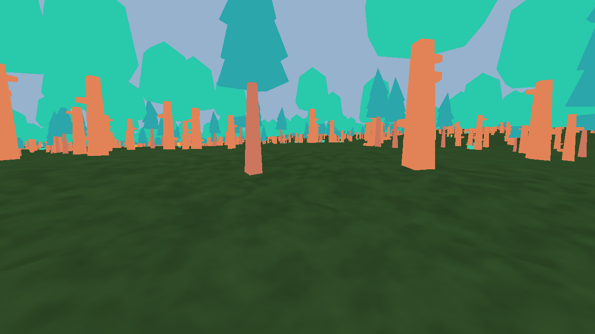
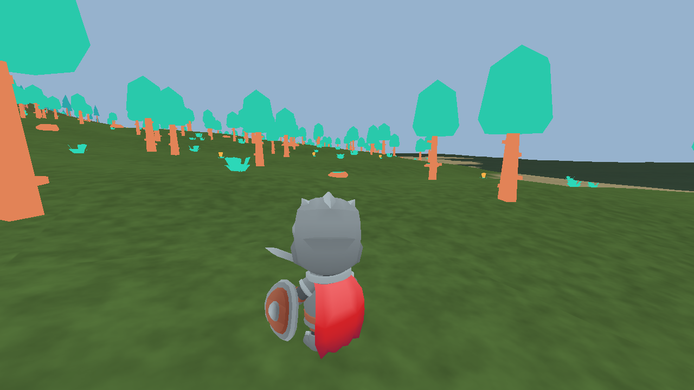
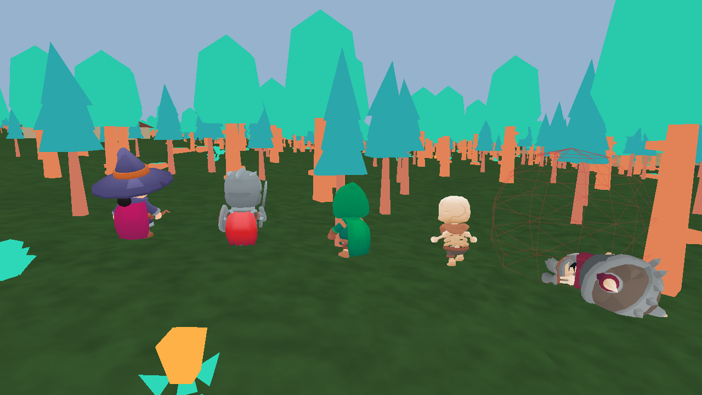

# 03 — Asset pubblici

## Premessa: il gioco non ne ha bisogno

Frostmark funziona con **zero file binari**. Texture, terreno, edifici, alberi e
personaggi sono generati a runtime da primitive (`GenMeshCylinder`, `GenMeshCone`,
`GenMeshSphere`, `GenMeshCube`) e da texture procedurali (`MakeGrainTexture`).
Questo è deliberato: un progetto didattico che si scarica e compila senza
dipendere da un CDN, e che non ha problemi di licenza da nessuna parte.

Gli asset esterni sono quindi un **innesto opzionale**. Questo documento spiega
dove prenderli restando nel pubblico dominio e dove esattamente agganciarli.

Stato degli innesti nel codice:

| Asset | Come si attiva |
|---|---|
| `assets/heightmap.png` | rilevato in automatico (`WorldInit`) |
| `assets/textures/grass.png` | rilevato in automatico (`LoadTerrainTexture`) |
| `assets/models/*.glb` | rilevati in automatico (`LoadExtProps`) |
| `assets/models/player.glb` | rilevato in automatico (`PlayerLoadModel`), con animazioni |
| `assets/models/npc_*.glb` | rilevati in automatico (`EntitiesLoadModels`) |
| `assets/fonts/ui.ttf` | **richiede modifiche a `ui.c`** (sezione 5) |
| `assets/audio/*` | **richiede modifiche a `main.c`** (sezione 6) |

I primi quattro bastano copiare al posto giusto: se il file manca, il gioco usa
la versione procedurale e non cambia niente.

---

## Fonti CC0 affidabili

CC0 significa rinuncia al diritto d'autore: uso commerciale libero, nessuna
attribuzione obbligatoria (resta comunque buona educazione citare l'autore).

| Fonte | Cosa offre | Licenza |
|---|---|---|
| **kenney.nl/assets** | modelli low-poly (78-114 triangoli), icone UI, font, suoni — download diretto, l'unica sorgente davvero adatta a questo progetto | CC0 |
| **ambientcg.com** | texture PBR tileable (erba, roccia, neve, legno, pietra) | CC0 |
| **polyhaven.com** | texture, HDRI, modelli fotogrammetrici — **troppo pesanti per i prop**, vedi sotto | CC0 |
| **quaternius.com** | modelli low-poly stilizzati: alberi, edifici, personaggi animati — download via Google Drive, non automatizzabile | CC0 |
| **opengameart.org** | archivio misto — **filtrare per CC0**, molti asset sono CC-BY o GPL | varia |
| **freesound.org** | suoni ambientali — **filtrare per CC0** | varia |
| **fontlibrary.org**, **fonts.google.com** | font (OFL) | OFL/varia |

Regola pratica: su OpenGameArt e Freesound la licenza va verificata asset per
asset. Su Kenney, ambientCG, Poly Haven e Quaternius è CC0 per tutto il catalogo.

**Attenzione**: *non* usare asset estratti da Skyrim o da altri giochi
commerciali. Non sono pubblici, e non lo diventano perché il gioco è vecchio.

---

## Pacchetti consigliati per Frostmark

Lo script `tools/fetch_assets.sh` elenca i download consigliati e prepara le
cartelle (non scarica automaticamente: gli URL cambiano e conviene che sia una
scelta consapevole).

```
assets/
  heightmap.png          terreno esterno (vedi doc 02)
  textures/
    grass.png                                    da ambientCG o Poly Haven
  models/
    tree.glb  pine.glb  rock.glb  bush.glb  herb.glb    dal Nature Kit di Kenney
    player.glb                                          personaggio animato, da KayKit
  fonts/
    ui.ttf                                       da Google Fonts
  audio/
    ambient_wind.ogg  hit.wav  step.wav          da Kenney / Freesound
```

### Download automatico dei modelli

```bash
./tools/fetch_assets.sh models
```

Scarica il **Nature Kit di Kenney**, verifica che `License.txt` dichiari CC0,
estrae cinque modelli, li rinomina come li cerca `world.c` e aggiunge le righe in
`assets/CREDITS.md`. L'URL non è inchiodato nello script: contiene un hash che
cambia a ogni aggiornamento del pacchetto, quindi viene letto dalla pagina.



**Perché Kenney e non Poly Haven.** Frostmark disegna centinaia di prop per
frame con `DrawModelEx`, senza LOD né instancing. I modelli di Kenney stanno tra
78 e 114 triangoli; su Poly Haven — pure CC0, ma fotogrammetria — l'albero più
leggero è `jacaranda_tree` a 312.000 triangoli e `pine_tree_01` arriva a 17
milioni. Sono ottimi per una scena renderizzata, inutilizzabili per una foresta
in tempo reale con questo renderer. Poly Haven resta utile per le **texture**.

**Attenzione ai .glb di Kenney: vanno riparati.** I kit sono esportati con
UniGLTF (Unity), che indica come radice della scena un nodo che ha già un
genitore (`tmpParent`). La specifica glTF 2.0 lo vieta, e cgltf — il parser di
raylib — rifiuta l'intero file:

```
WARNING: MODEL: [assets/models/tree.glb] Failed to load glTF data
```

Blender e three.js sono più permissivi, per questo il problema non è noto.
`tools/glb_fix_scene.py` ripunta la scena sui nodi radice veri senza toccare
geometria, materiali o trasformazioni; `fetch_assets.sh models` lo applica da
sé. Il Survival Kit di Kenney, esportato con UnityGLTF, non ha il difetto.

**La tavolozza non coincide.** Il Nature Kit è deliberatamente acido: fogliame
turchese (43, 166, 170) e tronchi salmone (204, 118, 94), anche nelle varianti
`_dark`. Sul terreno verde scuro di Frostmark stona. Due strade, entrambe
legittime:

1. schiarire e desaturare i colori di bioma in `WorldBiomeColor()`, adottando la
   tavolozza di Kenney per tutto il gioco;
2. riscrivere i `baseColorFactor` dei `.glb` con i colori usati da `DrawProp()`
   (CC0 permette la modifica; `assets/CREDITS.md` documenta la provenienza).

Il Survival Kit di Kenney ha verdi più naturali, ma contiene solo conifere e
dipende da una texture esterna (`Textures/colormap.png` accanto al modello).

---

## Punti di innesto nel codice

### 1. Texture del terreno (il più semplice, e quello che si vede di più)

Basta copiare una texture tileable in `assets/textures/grass.png`: viene caricata
da `LoadTerrainTexture()` in `world.c`, con mipmap, filtro trilineare e wrap
ripetuto. Se il file non c'è, si usa `MakeGrainTexture()` come prima.

Nota: i colori dei vertici (bioma + luce pre-calcolata) **moltiplicano** la
texture. Se la texture è molto colorata il risultato diventa cupo: in quel caso
conviene schiarire i colori di bioma in `WorldBiomeColor()` oppure usare texture
desaturate. Una texture fotografica a fuoco richiede anche di abbassare
`TERRAIN_UV_TILE` in `config.h` (metri coperti da una ripetizione, 8 di
default). Un passo avanti è il *texture splatting* (esercizio 8): la texture
attuale è unica per tutti i biomi.

### 2. Modelli al posto delle primitive

Copiare i file in `assets/models/` con questi nomi (`fetch_assets.sh models` lo
fa da sé):

| File | Sostituisce | Scala in `gExtProp` |
|---|---|---|
| `tree.glb` | l'albero (cilindro + sfera) | 3.8 → 6.5 m |
| `pine.glb` | il pino (cilindro + cono) | 4.4 → 6.8 m |
| `rock.glb` | il sasso (sfera schiacciata) | 2.2 → 2.2 m di larghezza |
| `bush.glb` | il cespuglio (sfera) | 4.2 → 1.0 m |
| `herb.glb` | l'erba curativa della quest | 4.5 → 0.9 m |

Casa, torre e cripta restano procedurali: nessun kit CC0 con download diretto
contiene edifici interi. Il Fantasy Town Kit di Kenney è modulare (muri, tetti,
angoli separati), quindi servirebbe comporre più modelli per edificio; Quaternius
ha case complete ma si scarica solo a mano da Google Drive.

`LoadExtProps()` in `world.c` li cerca all'avvio; `DrawProp()` usa il modello
quando c'è e ricade sulle primitive quando manca. raylib carica `.glb`/`.gltf`,
`.obj`, `.iqm`, `.m3d` — **non** `.fbx`: in quel caso passare per Blender ed
esportare glTF Binary. Con `.glb` le texture sono dentro al file e vengono
applicate da sole; con `.obj` serve il `.mtl` a fianco.

La tabella `gExtProp` in `world.c` tiene nome del file e fattore di scala:

```c
static const struct { const char *file; float scale; } gExtProp[PROP_COUNT] = {
    [PROP_TREE]  = { "assets/models/tree.glb",  2.0f },
    ...
};
```

La scala converte l'unità del modello nelle dimensioni usate dalle primitive
(un albero procedurale è alto ~4.6 m) e **va ritoccata a occhio** secondo il
pacchetto scaricato: Kenney e Quaternius esportano a circa 1 unità = 1 m con
l'origine alla base, che è l'assunzione del codice. Per aggiungere altri tipi
(cespuglio, torre, cripta) basta una riga nella tabella.

Per i modelli **animati** servono `LoadModelAnimations()` e
`UpdateModelAnimation()` — è il salto di qualità più visibile per gli NPC
(esercizio 10).

### 3. Personaggio animato del giocatore

```bash
./tools/fetch_assets.sh player          # cavaliere
./tools/fetch_assets.sh player Mage     # o Barbarian, Rogue, Rogue_Hooded
```

Scarica un personaggio dal **KayKit Adventurers Character Pack** di Kay
Lousberg (CC0) in `assets/models/player.glb`: un solo file, texture inclusa,
scheletro a 41 ossa e **76 animazioni**. Se il file c'è, in terza persona
sostituisce le primitive.



`src/player.c` non chiama le animazioni per indice ma **le cerca per nome**
(tabella `ANIM_WANTED`): prima per uguaglianza esatta, poi per sottostringa,
ignorando maiuscole. Servono nove ruoli, e all'avvio il gioco stampa la
mappatura trovata:

```
INFO: PLAYER: modello assets/models/player.glb (15 mesh, 41 ossa, 76 animazioni)
INFO: PLAYER:   riposo       -> Idle
INFO: PLAYER:   camminata    -> Walking_A
INFO: PLAYER:   corsa        -> Running_A
INFO: PLAYER:   attacco      -> 1H_Melee_Attack_Slice_Diagonal
INFO: PLAYER:   parata       -> Blocking
INFO: PLAYER:   incantesimo  -> Spellcast_Shoot
INFO: PLAYER:   salto        -> Jump_Idle
INFO: PLAYER:   colpito      -> Hit_A
INFO: PLAYER:   morte        -> Death_A
```

Così funzionano anche altri pacchetti senza toccare il codice: il robot di
Quaternius (`Robot_Walking`, `Robot_Punch`…, CC0, in
`vendor/raylib/examples/models/resources/models/gltf/robot.glb`) e il greenman
degli esempi di raylib (`2_move`, `3_attack`, CC0). Se un ruolo risulta
"assente", si aggiunge il nome giusto ad `ANIM_WANTED`; la scala si regola con
`PLAYER_MODEL_SCALE` in `config.h` (altezza voluta ÷ altezza del modello).

Quale animazione va in scena lo decide `PickAnim()` dallo stato di gioco, in
ordine di priorità: morte, colpo ricevuto, attacco, incantesimo, parata, salto,
corsa, camminata, riposo. Le clip ciclabili scorrono a 60 fps — camminata e
corsa vengono riprodotte in proporzione alla velocità reale, così i piedi non
slittano — mentre quelle a colpo singolo vengono compresse nella durata
dell'azione: il fendente KayKit dura 59 fotogrammi, quasi un secondo, ma il
colpo si esaurisce in 0,4 s, e senza `OneShotSeconds()` la spada si fermerebbe a
metà del movimento.

**Due trappole di raylib, entrambe già gestite.**

1. *I modelli misti fanno crollare l'animazione.* I pacchetti di personaggi
   contengono armi, scudi ed elmi come mesh separate agganciate a un osso.
   `UpdateModelAnimation()` di raylib 5.5 legge però `mesh.boneWeights` su
   **tutte** le mesh del modello, anche su quelle senza pesi, e dereferenzia un
   puntatore nullo: segmentation fault. `BuildSkinnedView()` in `player.c`
   costruisce quindi una vista del modello con le sole mesh dotate di scheletro
   (condividendo i dati, senza copiare nulla) e anima quella.

2. *Le mesh agganciate alle ossa non si muovono.* Sempre perché raylib deforma
   solo le mesh con pesi, spada, scudo, elmo e mantello resterebbero fermi nella
   posa di riposo, sospesi a mezz'aria mentre il corpo si muove — e raylib perde
   anche il nome della mesh e il legame con l'osso. Come vengono agganciati è
   spiegato qui sotto.

#### L'aggancio delle armi

Il problema è di informazioni mancanti, non di matematica: raylib non conserva i
nomi delle mesh né la gerarchia dei nodi, quindi dal solo `Model` non si sa che
la mesh numero 5 è la spada e va attaccata all'osso `handslot.r`.

`tools/glb_attachments.py` ricostruisce la corrispondenza leggendo il glTF e la
scrive accanto al modello, in `assets/models/player.attach`:

```
# Formato: <indice mesh> <nome osso>   # nome originale
5 handslot.r   # arma: 1H_Sword
3 handslot.l   # scudo: Round_Shield
7 head         # elmo: Knight_Helmet
8 chest        # mantello: Knight_Cape

# Alternative: togli il cancelletto per usarle al posto di sopra.
# 6 handslot.r   # 2H_Sword
# 4 handslot.l   # Spike_Shield
```

È un file di testo: per passare allo spadone o a un altro scudo basta spostare
un cancelletto, senza ricompilare. `fetch_assets.sh player` lo genera da sé.

L'indice della mesh si può prevedere perché raylib crea **una mesh per
primitiva visitando i nodi in ordine** (`LoadGLTF` in `rmodels.c`), e ci cuoce
dentro la trasformazione del nodo — cioè i vertici dell'arma sono già in spazio
modello nella posa di riposo. Serve quindi solo portarli dalla posa di riposo a
quella corrente:

```
M = posaCorrente(osso) × inversa(posaDiRiposo(osso))
```

`BoneMatrix()` in `player.c` compone esattamente questa matrice, con la stessa
formula che raylib usa internamente in `UpdateModelAnimationBones()`: usarne una
diversa farebbe muovere l'arma in modo leggermente sfasato rispetto al corpo.
`model.bindPose[osso]` dà la posa di riposo, `anim.framePoses[frame][osso]` quella
corrente, entrambe in spazio modello.

Il controllo che vale la pena fare, se si cambia pacchetto, è guardare
l'animazione di morte: se la matrice è sbagliata il corpo cade e l'arma resta in
piedi a mezz'aria.

### 4. NPC animati

```bash
./tools/fetch_assets.sh npc
```

Installa cinque personaggi CC0 (KayKit *Adventurers* e *Skeletons*), uno per
ruolo:

| File | Chi anima | Modello |
|---|---|---|
| `npc_villager.glb` | popolano, mercante, anziano | Mage |
| `npc_guard.glb` | guardia | Knight |
| `npc_bandit.glb` | bandito | Rogue_Hooded |
| `npc_revenant.glb` | redivivo | Skeleton_Minion |
| `npc_boss.glb` | Vald il Sepolto | Skeleton_Warrior |



La tabella `NPC_MODEL` in `entity.c` associa tipo, file e altezza. Tre tipi
puntano allo stesso file, e in quel caso il modello viene caricato una volta
sola. Il **lupo resta procedurale**: fra i pacchetti CC0 usati non c'è un
quadrupede animato.

L'animazione la scegle lo stato dell'IA, che è già una macchina a stati:
`AI_DEAD` → morte, `AI_ATTACK` → attacco, `AI_CHASE` → corsa, `AI_WANDER` →
camminata, altrimenti riposo. Il passo scala con `e->speed`, così un redivivo
lento non pattina come un bandito.

**Un solo modello serve molti personaggi.** `UpdateModelAnimation()` scrive i
vertici deformati nel buffer del modello: contiene una posa alla volta. Non
serve però una copia per NPC — basta rideformare **dentro il ciclo di disegno**,
una volta per personaggio, perché ogni `DrawMesh` usa la posa appena calcolata.
Misurato: **0,06 ms per istanza** (deformazione più caricamento del buffer), cioè
1 ms per sedici NPC visibili su un budget di 16,7 ms a 60 fps. Il numero di
istanze è limitato dal culling, non dalla memoria.

Oltre `NPC_MODEL_DIST` (140 m) si torna alle primitive: a quella distanza un
passo non si distingue e la rideformazione non ripaga.

**Il costo vero è la memoria.** Ogni pacchetto porta 76-95 clip di cui il gioco
usa nove, e una posa sono 41 ossa × 40 byte per ogni fotogramma di ogni clip.
Misurato con `/usr/bin/time` (picco di RSS):

| Configurazione | Picco RSS |
|---|---|
| senza modelli di personaggio | 154 MB |
| sei modelli, tutte le clip | 245 MB |
| sei modelli, clip inutilizzate liberate | 207 MB |

`DropUnusedAnims()` in `charmodel.c` libera le pose delle clip che nessun ruolo
usa, azzerandone `frameCount` perché `UnloadModelAnimations()` non le ripassi.
Restano ~53 MB per sei personaggi: sul desktop non è un problema, ma la build
WebAssembly gira con `TOTAL_MEMORY=134217728` e va alzata. Il passo successivo,
se serve, è togliere le clip inutilizzate direttamente dal `.glb`.

### 5. Font dell'interfaccia

`ui.c` usa `DrawText()`, che impiega il font di default (bitmap, un po' rigido).
Con un TTF:

```c
/* una volta, all'avvio */
Font uiFont = LoadFontEx("assets/fonts/ui.ttf", 32, NULL, 0);
SetTextureFilter(uiFont.texture, TEXTURE_FILTER_BILINEAR);

/* al posto di DrawText(...) */
DrawTextEx(uiFont, testo, (Vector2){ x, y }, size, 1.0f, colore);
```

Conviene metterlo in `Game` e passarlo alle funzioni di `ui.c`, oppure tenerlo in
una variabile `static` del modulo.

### 6. Audio

Frostmark non usa audio: aggiungerlo richiede solo `InitAudioDevice()` in
`main.c` e quattro chiamate. Suoni consigliati: colpo a segno, passo, ambiente,
musica di sottofondo del villaggio.

```c
InitAudioDevice();
Sound hit = LoadSound("assets/audio/hit.wav");
Music amb = LoadMusicStream("assets/audio/ambient_wind.ogg");
PlayMusicStream(amb);
/* nel loop */ UpdateMusicStream(amb);
/* quando il colpo va a segno */ PlaySound(hit);
```

Il volume dell'ambiente può essere modulato dal bioma e dall'ora del giorno: due
righe, e il mondo cambia carattere.

---

## Come tenere pulita la licenza

1. Un file `assets/CREDITS.md` con: nome asset, autore, fonte, licenza, data di
   download. Anche quando CC0 non lo richiede.
2. Non committare asset di terze parti nel repository se non si è certi della
   licenza: meglio uno script di download.
3. Se si accettano asset CC-BY, l'attribuzione deve comparire **nel gioco**
   (schermata crediti), non solo nel README.
